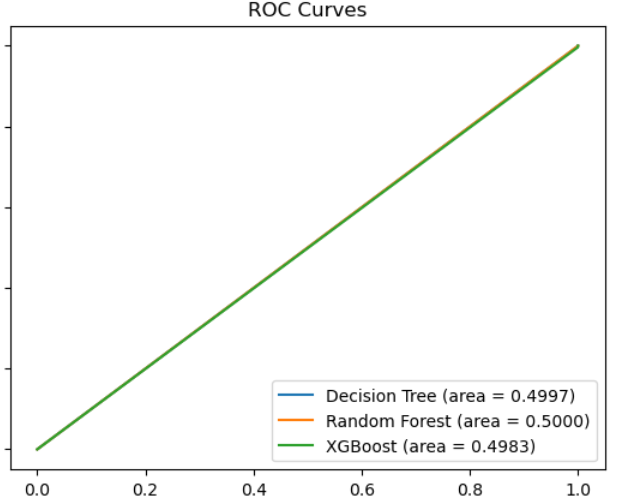

# Data Science in Finance:Predicting Loan Defaults and Repayments

## by: Nyabaga Nyatichi Abigael

## Business Understanding:
###  Overview
The Lending Club Platform is a platform that allows individuals to loan other individuals.Not all loans are created equal. Someone who is a essentially a sure bet to pay back a loan will have an easier time getting a loan with a low interest rate than someone who appears to be riskier. And for people who are very risky may not even get a loan offer, or they may not have accepted the loan offer due to a high interest rate.As a data scientist in this platform I have been tasked with the duty of comming up with a predictive model that solves the issue to avoid loosing funds or loosing customers.

**challenge:** The problem that led to this project is that the traditional creditworthiness assesments.This situation can limit access to credit for some borrowers or lead to inefficiencies for lenders. A more accurate and inclusive method of assessing creditworthiness is needed to improve the lending process for both sides.

**solution:** This project proposes a solution that leverages the power of machine learning to move beyond the limitations of traditional creditworthiness assessments leading to: More accurate predictions of loan repayment behavior,potentially identify creditworthy borrowers who might be overlooked by traditional methods and automate some aspects of the credit assessment process.

>Problem statement: the aim of this project is to build a model that predicts if LendingClub loans will be paid back or defaulted. We'll use LendingClub's data on borrowers, loans, and repayment history to find factors affecting repayment. By applying machine learning, we want to create an accurate model to help financial institutions assess creditworthiness, improve risk management, and make better lending decisions.
## Data Understanding
**source**:we will be using the LendingClub dataset which is available on Kaggle. The data has a data frame with 10,000 observations on the following 55 variables.
**target variable and relevant variables**
~ our target variable is loan_status

~ our main features include: 'loan_amount','emp_title', 'term','interest_rate','installment', 'grade','homeownership','annual_income', 'verified_income','delinq_2y','loan_purpose','accounts_opened_24m','inquiries_last_12m', 'public_record_bankrupt', 'long_emp','short_emp','loan_status_bin'
## Models
The models we used are:
> for trainind our models: decision trees,decision tree,Random forest,Xgboost
> for evaluating we used: Classification Report,Precision-Recall Curve (PRC)and AUC
## Results

## Recommendations and Conclusion
We discovered there are specific factors that relate withdefaulting of loans. These include: interest rate,length of employment,pourpose of the loan and the grade of the loan. These factors should be studied more to  enhance prediction of losn defaulting.
From our results of the AUC analysis, I can advice Lending club group to use the Random forest model to make their prediction as it seems to have a higher value of Areaa under the curve. Further analysis with F1-score and potentially cost-sensitive learning is recommended to make a more informed decision, especially if minimizing false positives is important this is because there might be a possibility of class imbalance. Those taking up this project might consider solving that issue.
## Presentation link
>[Link text](URL)

